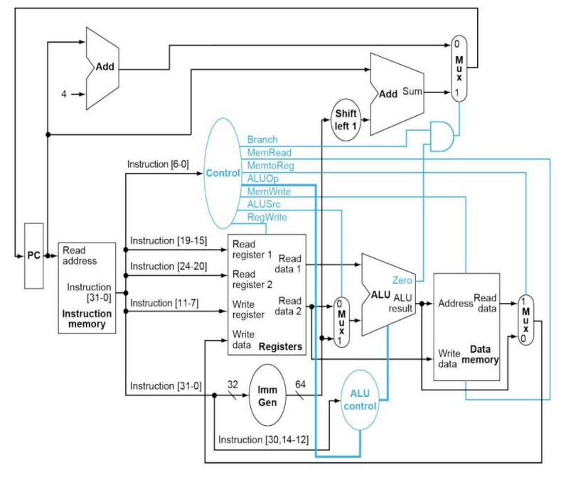

# RISC-V Processor Implementation (Xilinx Vivado)

**Modular, synthesizable RISC-V processor core built in Verilog HDL and deployed/tested using Xilinx Vivado.**

## Overview

This project demonstrates the implementation of a single-cycle RISC-V processor, covering fundamental concepts of digital design, CPU architecture, modular coding, and hardware verification. The project is divided into clean modules, allowing for easy extension and adaptation.  
The processor is designed to execute instructions loaded from a hex file, demonstrating program execution, memory access, ALU operations, and basic control flow.

## Key Features

- **Modular Top-Level Design:**  
  Separate modules for instruction fetch, decode, register file, ALU, memory and control.
- **RISC-V Compliance:**  
  Supports basic RISC-V instructions in hexadecimal format; extensible for additional instructions.
- **Vivado Project Ready:**  
  Provided `.xpr` for direct opening in Xilinx Vivado, streamlining FPGA synthesis and simulation.
- **Testbench Driven Development:**  
  Includes simulation-ready testbench to verify core functionality under realistic clock/reset stimuli.
- **External Program Loading:**  
  Instruction memory is initialized from a hex file (`instruction.txt`), allowing custom test program execution.

## How to Use

1. **Open Project:**  
   - Launch Xilinx Vivado and open `RISC-V_PDF_BASED.xpr`.
   - All source files are already included for synthesis/simulation.

2. **Run Simulation:**  
   - Use provided testbench (`sim/Top_Level_tb.v`) to simulate the design.
   - The instruction memory loads `instruction.txt` during simulation startup; you can easily replace this file with your own hex programs.

3. **Modify or Extend:**  
   - Add new instructions or modify ALU/control logic as needed.
   - All modules are designed for readability and scalability.

## Verification

- **Testbench:**  
  Applies clock/reset, loads instruction memory, monitors processor outputs (e.g., PC, registers, memory).
- **Traceability:**  
  Commented code, consistent signal naming, and modular hierarchy for easy debug and extension.
- **Waveform Analysis:**  
  Use Vivado simulation tools (GTKWave, integrated waveform viewer) to observe processor internals.

## What You'll Learn

- Verilog modular design and interfacing
- RISC-V CPU architecture basics (fetch-decode-execute)
- Simulation and debugging in Vivado
- Practical program execution and verification

## Example: Running a Custom Program

To test your own RISC-V program sequence:
- Place the hex instructions in `instruction.txt`
- Simulate (`Top_Level_tb.v`) and check output registers/memory for expected results

## Author

Dhruv Kansal

## License

For educational and personal use. Please cite/credit if used in a public project.

---

